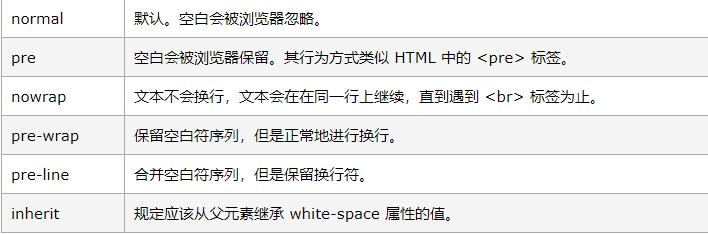
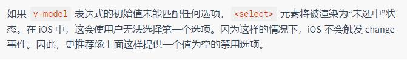
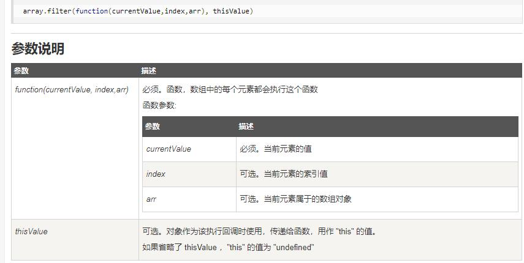

template------------相当于view层
script------------相当于model层

添加网站小图标，
<link rel="shortcut icon" type="image/x-icon" href="./favicon.ico" rel="external nofollow" />

rel="external nofollow" ----包括另外两种值，是为了告诉浏览器是否计入搜索权重
[注]这个图标的格式最好是32*32或者16*16的ico文件
也可以是其他格式的，
但是需要注意图片的路径不能是src文件夹下面的（由于浏览器解析的问题）
建议放在static的文件夹下面，使用绝对路径
例如，<link rel="shortcut icon" type="image/x-icon" href="static/bitbug_favicon.ico"/>

vue很坑的第一点，对空格换行比较严格很坑


7.25
1.methods
方法中不操作dom，只关注逻辑


2.placeholder 属性适用于下面的 input 类型：text、search、url、tel、email 和 password。
用于输入框输入之前简短的提示

3.white-space


4.label的for属性，是绑定元素的id
5.对于单选框的兼容性问题


7.29

1.filter方法
   会自动遍历数组，返回一个新的符合过滤条件的数组

/*v-model 真真是一个小可爱  */


# vueproject

> A Vue.js project

## Build Setup

``` bash
# install dependencies
npm install

# serve with hot reload at localhost:8080
npm run dev

# build for production with minification
npm run build

# build for production and view the bundle analyzer report
npm run build --report

# run unit tests
npm run unit

# run e2e tests
npm run e2e

# run all tests
npm test
```

For a detailed explanation on how things work, check out the [guide](http://vuejs-templates.github.io/webpack/) and [docs for vue-loader](http://vuejs.github.io/vue-loader).

<!-  a 标签的target属性，
target还可以重定向到任意一个单独的窗口
_blank 在一个新打开，未命名的窗口中载入目标文档
“_parent”的意思：这个目标使得文档载入父窗口或者包含来超链接引用的框架的框架集。
如果这个引用是在窗口或者在顶级框架中，那么它与目标 _self 等效。

3、“_self”的意思：这个目标的值对所有没有指定目标的 <a> 标签是默认目标
它使得目标文档载入并显示在相同的框架或者窗口中作为源文档。
这个目标是多余且不必要的，除非和文档标题 <base> 标签中的 target 属性一起使用。

4、“_top”的意思：这个目标使得文档载入包含这个超链接的窗口，
用 _top 目标将会清除所有被包含的框架并将文档载入整个浏览器窗口。
		-->
        


//刚开始的helloworld组件

<template>
  <div class="hello">
    <h1>{{ msg }}</h1>
    <h2>Essential Links</h2>
    <ul>
      <li>
        <a
          href="https://vuejs.org"
          target="_blank"
        >
          Core Docs
        </a>
      </li>
      <li>
        <a
          href="https://forum.vuejs.org"
          target="_blank"
        >
          Forum
        </a>
      </li>
      <li>
        <a
          href="https://chat.vuejs.org"
          target="_blank"
        >
          Community Chat
        </a>
      </li>
      <li>
        <a
          href="https://twitter.com/vuejs"
          target="_blank"
        >
          Twitter
        </a>
      </li>
      <br>
      <li>
        <a
          href="http://vuejs-templates.github.io/webpack/"
          target="_blank"
		  
        >
           Docs for This Template
        </a>
      </li>
    </ul>
    <h2>Ecosystem</h2>
    <ul>
      <li>
        <a
          href="http://router.vuejs.org/"
          target="_blank"
        >
          vue-router
        </a>
      </li>
      <li>
        <a
          href="http://vuex.vuejs.org/"
          target="_blank"
        >
          vuex
        </a>
      </li>
      <li>
        <a
          href="http://vue-loader.vuejs.org/"
          target="_blank"
        >
          vue-loader
        </a>
      </li>
      <li>
        <a
          href="https://github.com/vuejs/awesome-vue"
          target="_blank"
        >
          awesome-vue
        </a>
      </li>
    </ul>
  </div>
</template>

<script>
export default {
  name: 'HelloWorld',
  data () {
    return {
      msg: 'hello my name is 小戏精'
    }
  }
}
</script>

<!-- Add "scoped" attribute to limit CSS to this component only -->
<style scoped>
h1 {
	background-color:#acfe52;
}
h1, h2 {
  font-weight: normal;
}
ul {
  list-style-type: none;
  padding: 0;
}
li {
  display: inline-block;
  margin: 0 10px;
}
a {
  color: #42b983;
}
</style>
